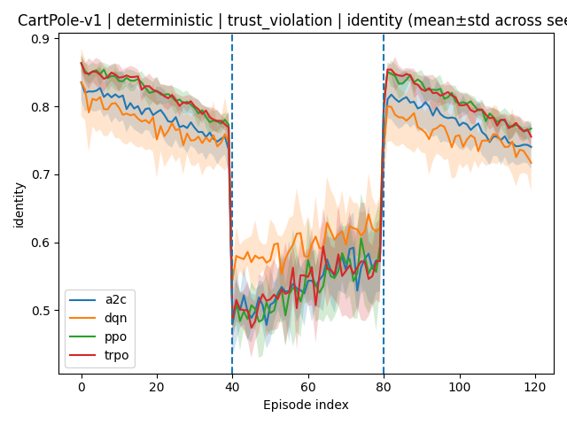
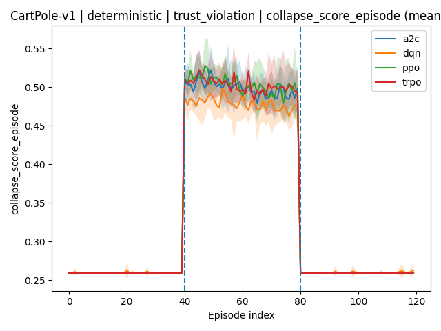
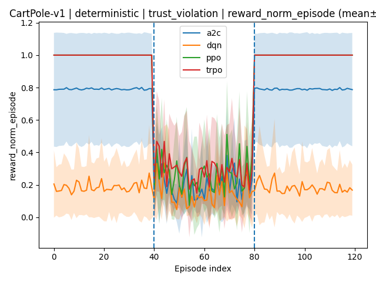

# ARCUS-H 1.0
## Adaptive Reinforcement Coherence Under Stress
### Open Benchmark for Identity Stability in Reinforcement Learning

ARCUS-H is an open-source evaluation harness that adds a second axis to RL benchmarking:

> **Stability under structured stress — not just reward.**

---

# Why another benchmark?

Standard RL optimizes:

$$
J(\pi) = \mathbb{E}\left[\sum_{t=0}^{T} \gamma^t r_t\right]
$$

But return alone does not reveal how an agent behaves when execution assumptions are violated.

ARCUS-H evaluates robustness under controlled stress.

---

# Evaluation Protocol

Each episode is divided into:

$$
\textbf{PRE} \rightarrow \textbf{SHOCK} \rightarrow \textbf{POST}
$$

Let:

- $\mathcal{T}_{pre}$  
- $\mathcal{T}_{shock}$  
- $\mathcal{T}_{post}$  

During SHOCK, action or reward is modified.

---

# Stress Models

## 1️⃣ Resource Constraint

Continuous scaling:

$$
a_t^{exec} = \alpha a_t, \quad 0 < \alpha < 1
$$

Discrete dropout:

$$
a_t^{exec} =
\begin{cases}
a_t & \text{with prob } p \\
\text{noop} & \text{otherwise}
\end{cases}
$$

---

## 2️⃣ Trust Violation

Continuous distortion:

$$
a_t^{exec} = a_t + \epsilon, \quad \epsilon \sim \mathcal{N}(0,\sigma^2)
$$

Discrete permutation:

$$
a_t^{exec} = P(a_t)
$$

---

## 3️⃣ Valence Inversion

Reward flip:

$$
r_t^{exec} = -r_t
$$

Affine corruption:

$$
r_t^{exec} = \lambda r_t + b
$$

---

# Identity & Collapse Metrics

## Phase Means

$$
\mu_{pre}(X) = \frac{1}{|\mathcal{T}_{pre}|}
\sum_{t \in \mathcal{T}_{pre}} X_t
$$

$$
\mu_{shock}(X) = \frac{1}{|\mathcal{T}_{shock}|}
\sum_{t \in \mathcal{T}_{shock}} X_t
$$

Pre→Shock drop:

$$
\Delta_X = \mu_{pre}(X) - \mu_{shock}(X)
$$

---

## Collapse Score

Deficits:

$$
d^m_t = \max(0, \tau_m - m_t)
$$

$$
d^i_t = \max(0, \tau_i - i_t)
$$

Weighted mass:

$$
raw_t = w_m d^m_t + w_i d^i_t + w_{id} d^{id}_t + w_u u_t
$$

Normalized:

$$
raw^{(n)}_t = \frac{raw_t}{raw_t + 1}
$$

Sigmoid collapse:

$$
S_t = \sigma(\beta(raw^{(n)}_t - \gamma))
$$

Shock collapse rate:

$$
CR_{shock} =
\frac{1}{|\mathcal{T}_{shock}|}
\sum_{t \in \mathcal{T}_{shock}}
\mathbf{1}[S_t > \eta]
$$

---

# Robustness Score

$$
robust =
0.30
+ 0.55 \cdot id_{mean}
- 0.30 \cdot CR_{shock}
+ 0.15 \cdot rwd_{norm}
$$

---

# Included Environments

- CartPole-v1  
- Acrobot-v1  
- MountainCar-v0  
- MountainCarContinuous-v0  
- Pendulum-v1  

Supports discrete and continuous action spaces.

---

# Leaderboard Snapshot

Extract from `leaderboard_overall.csv`:

| Algo | Mode | Robust | Identity | CR_shock | Reward_norm |
|------|------|--------|----------|----------|-------------|
| td3  | stochastic | 0.8079 | 0.6840 | 0.0542 | 0.9863 |
| ddpg | stochastic | 0.8034 | 0.6704 | 0.0500 | 0.9978 |
| trpo | deterministic | 0.7870 | 0.7283 | 0.0687 | 0.7136 |

Full CSV:

```
runs/_leaderboard/
```

---

# Example: CartPole — Trust Violation

Identity:



Collapse Score:



Reward_norm:



---

# Reproducibility

## Install

```bash
git clone https://github.com/karimzn00/ARCUSH_1.0.git
cd ARCUSH_1.0

python -m venv .venv
source .venv/bin/activate
pip install -r requirements.txt
```

---

## Train

```bash
python -m arcus.harness_rl.run_train   --env CartPole-v1   --algo ppo   --timesteps 200000   --seeds 0-9
```

---

## Evaluate

```bash
python -m arcus.harness_rl.run_eval   --run_dir RUN_DIR   --env CartPole-v1   --algo ppo   --episodes 120   --seeds 0-9   --both
```

---

## Compare

```bash
python -m arcus.harness_rl.compare   --root RUN_DIR   --print   --write_csv   --plots
```

---

# License

MIT License.
