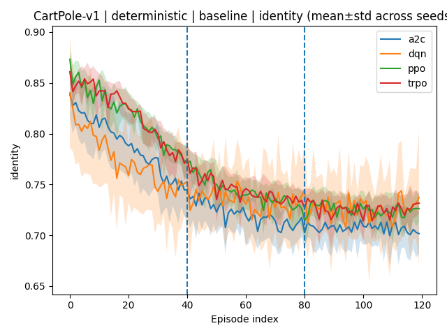

# ARCUS-H 1.0  
## Adaptive Reinforcement Coherence Under Stress — Evaluation Harness for RL

ARCUS-H introduces a complementary evaluation axis to reinforcement learning:

> **Identity Stability and Collapse Under Controlled Stress**

Traditional RL benchmarks compress evaluation into episodic return.  
ARCUS-H evaluates whether an agent remains coherent and stable when execution conditions deviate from nominal assumptions.

---

# Why ARCUS-H?

Two agents may achieve similar reward.

Under:
- reduced control authority  
- action mistrust / permutation  
- reward corruption  

their internal stability profiles can diverge dramatically.

ARCUS-H makes this divergence measurable.

---

# Core Evaluation Protocol

Each evaluation run is divided into three aligned phases:

PRE → SHOCK → POST

During SHOCK, ARCUS-H applies controlled transformations to executed actions and/or rewards.

---

# Implemented Stress Schedules

| Schedule | Description |
|-----------|-------------|
| baseline | No perturbation |
| resource_constraint | Reduced control authority |
| trust_violation | Action mismatch / distortion |
| valence_inversion | Reward sign flip |

---

# Core Metrics

ARCUS-H reports:

- Identity trajectory
- Pre→Shock identity drop
- Continuous collapse score
- Shock collapse rate
- Normalized reward
- Robustness score

Robustness score:

robust = 0.30  
     + 0.55 × id_mean  
     − 0.30 × CR_shock  
     + 0.15 × reward_norm  

---

# Leaderboard (Overall)

Aggregated across seeds (0–9).

See:

runs/_leaderboard/leaderboard_overall.csv

---

# Example: CartPole-v1 (Deterministic)

### Identity — Baseline

### Identity — Trust Violation

### Collapse Score — Trust Violation

### Reward_norm — Trust Violation

Return alone does not capture stress fragility.

---

# Deterministic Stress Results

Full plots available under:

runs/_leaderboard/plots/<ENV>/

Environments:

- Acrobot-v1
- CartPole-v1
- MountainCar-v0
- MountainCarContinuous-v0
- Pendulum-v1

---

# Reproducing Results

## Install

git clone https://github.com/karimzn00/ARCUSH_1.0.git  
cd ARCUSH_1.0  

python -m venv .venv  
source .venv/bin/activate  
pip install -r requirements.txt  

---

## Train Example

python -m arcus.harness_rl.run_benchmark --env CartPole-v1 --algo ppo --timesteps 200000 --seeds 0-9

---

## Evaluate Under Stress

python -m arcus.harness_rl.run_eval --run_dir RUN_DIR --env CartPole-v1 --algo ppo --episodes 120 --seeds 0-9 --both

---

## Compare + Generate Plots

python -m arcus.harness_rl.compare --root RUN_DIR --print --write_csv --plots

---

# Paper

See `arcus_h_paper.pdf` for the full formal specification and experiments.

---

# License

MIT License.
