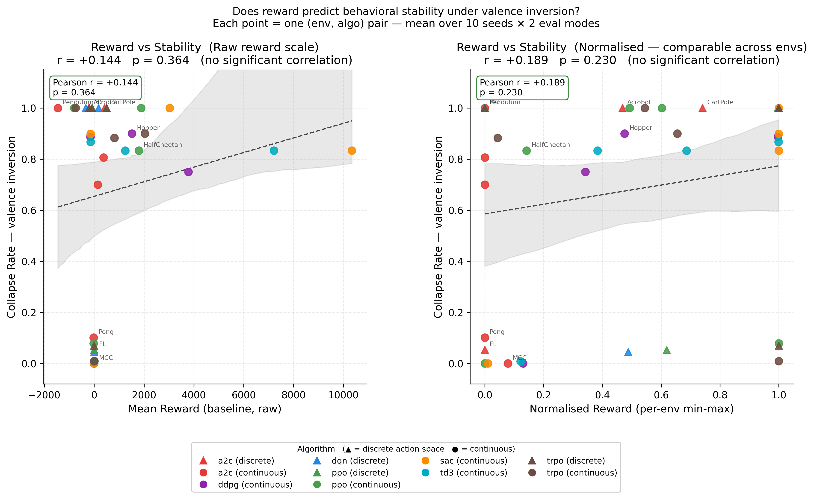

# ARCUS-H 1.0
## Adaptive Reinforcement Coherence Under Stress
### Open Benchmark for Behavioral Stability in Reinforcement Learning

[](https://zenodo.org/records/19075898)
[](LICENSE)
[](https://www.python.org/)
[](https://stable-baselines3.readthedocs.io/)


> **ARCUS-H is an open-source evaluation harness that adds a second axis to RL benchmarking:
    Behavioral stability under structured stress — not just reward.**

[](https://zenodo.org/records/19075898)
[](LICENSE)

---

## Why another benchmark?

Standard RL optimizes:

$$J(\pi) = \mathbb{E}\left[\sum_{t=0}^{T} \gamma^t r_t\right]$$

But return alone does not reveal how an agent behaves when execution assumptions are violated.
ARCUS-H evaluates behavioral stability under controlled stress — and shows that **reward and
stability can diverge dramatically**.

**Key empirical finding:** Pearson $r = +0.14$, $p = 0.364$ between normalized reward and
collapse rate under valence inversion across 9 environments and 7 algorithms. High-reward
agents are not necessarily stable agents.

---

## What's in ARCUS-H 1.0

| Dimension | Coverage |
|-----------|----------|
| Environments | 9: 6 classic control, 2 MuJoCo, 1 Atari (Pong) |
| Algorithms | 7: PPO, A2C, TRPO, DQN, DDPG, SAC, TD3 |
| Stressors | 4: concept drift, resource constraint, trust violation, valence inversion |
| Seeds | 10 per configuration |
| Eval modes | Deterministic + stochastic |
| Total runs | ~830 (env × algo × seed × mode × schedule) |

---

## Evaluation Protocol

Each evaluation run is divided into three contiguous phases:

$$\textbf{PRE} \;\rightarrow\; \textbf{SHOCK} \;\rightarrow\; \textbf{POST}$$

With 120 episodes per run (40 per phase). Stress transformations apply **only during SHOCK**.

---

## Stress Schedules

### 1. Concept Drift (CD)
Observation distribution shifts during shock via an auto-calibrated additive drift:

$$s_t^{exec} = s_t + \delta_t, \quad \delta_t = \delta_{t-1} + \varepsilon_t, \quad \varepsilon_t \sim \mathcal{N}(0, \sigma_{obs}^2 I)$$

$\sigma_{obs}$ is calibrated from the reference pass — no free parameters.

### 2. Resource Constraint (RC)
Models reduced control authority.

Continuous: $a_t^{exec} = \kappa a_t, \quad 0 < \kappa < 1$

Discrete: $a_t^{exec} = \begin{cases} a_t & \text{with prob } 1-p \\ a_{default} & \text{otherwise} \end{cases}$

### 3. Trust Violation (TV)
Models action-execution mismatch.

Continuous: $a_t^{exec} = \mathbf{M} a_t + \varepsilon_t$

Discrete: $a_t^{exec} = \pi_f(a_t)$ (fixed non-identity permutation)

### 4. Valence Inversion (VI)
Corrupts reward feedback:

$$r_t^{exec} = -r_t$$

Designed as the severest stressor — reward sign inversion renders the agent's optimization objective inconsistent with its learned policy.

---

## Behavioral Stability Channels

ARCUS-H constructs a per-episode stability score $I_e \in [0,1]$ from five interpretable channels.
No internal model access is required — all channels are computed from episode statistics.

| Channel | What it measures |
|---------|-----------------|
| **Competence** | Reward improvement relative to recent EMA trend |
| **Coherence** | Action smoothness (switch rate / jerk) |
| **Continuity** | Self-consistency across consecutive episodes |
| **Integrity** | Fidelity to pre-phase behavioral anchor |
| **Meaning** | Constraint respect and regret-free behavior |

$$I_e = w_c c_e + w_h h_e + w_t t_e + w_i i_e + w_m m_e$$

Weights are derived from per-channel baseline MADs — noisier channels receive lower weight automatically.

---

## Adaptive Calibration

A key contribution is the **adaptive p95 threshold**: the binary collapse event threshold is set to the 95th percentile of collapse scores computed over the pre-phase of each run:

$$\eta = \mathrm{p95}\!\left(\{S_e : e \in \mathcal{T}_{pre}\}\right)$$

This achieves FPR $\approx \alpha = 0.05$ by construction without any environment-specific tuning.
Empirical mean FPR across 83 runs: **2.0%**.

---

## Metrics

**Shock collapse rate:**
$$CR_{shock} = \frac{1}{|\mathcal{T}_{shock}|}\sum_{e \in \mathcal{T}_{shock}} \mathbf{1}[S_e \geq \eta]$$

**Pre-to-shock stability drop:**
$$\Delta I = \mu_{pre}(I) - \mu_{shock}(I)$$

**Leaderboard score** (stability-weighted):
$$\mathrm{robust} = 0.55 \cdot \bar{I} + 0.30 \cdot (1 - CR_{shock}) + 0.15 \cdot \mathrm{rwd\_norm}$$

---

## Key Results

### Reward does not predict stability



Pearson $r = +0.14$, $p = 0.364$ — no significant correlation between normalized reward and collapse rate. High-reward MuJoCo agents collapse at 73–84% under stress; DQN on MountainCar collapses near 0%.

---

### Collapse rate heatmap (all envs × stressors)


---

### Each stressor has a distinct channel signature


- **CD** depresses integrity (observation shift breaks behavioral anchor)
- **TV** suppresses all channels uniformly
- **VI** attacks meaning (inverted reward generates constraint-violating behavior)
- **RC** reduces competence and coherence

---

### Deterministic vs stochastic verdicts agree strongly


Pearson $r = 0.82$–$0.96$ across stressors — eval mode choice does not change ARCUS-H rankings.

---

### Discrete vs continuous action spaces


Continuous action spaces are significantly more vulnerable under RC, TV, and VI (Mann-Whitney $p < 0.001$ for VI).

---

### Suite-level comparison


MuJoCo agents collapse most severely (73–84%) despite achieving the highest reward — the clearest demonstration of reward/stability divergence.

---

## Leaderboard (baseline schedule, deterministic)

Top performers per environment:

| Environment | Algo | Robust | Identity | CR_shock | Rew_norm |
|-------------|------|--------|----------|----------|----------|
| MountainCar-v0 | dqn | 0.972 | 0.950 | 0.001 | 1.000 |
| MountainCarContinuous-v0 | trpo | 0.940 | 0.891 | 0.000 | 1.000 |
| Hopper-v4 | sac | 0.904 | 0.848 | 0.042 | 1.000 |
| Acrobot-v1 | trpo | 0.920 | 0.856 | 0.005 | 1.000 |
| CartPole-v1 | trpo | 0.891 | 0.833 | 0.056 | 1.000 |
| Pendulum-v1 | sac | 0.866 | 0.756 | 0.000 | 1.000 |
| Pong (ALE) | ppo | 0.859 | 0.772 | 0.053 | 0.912 |

Full leaderboard: [`runs/leaderboard.csv`](runs/leaderboard.csv)

Full tables (LaTeX-ready): [`runs/plots/tables/`](runs/plots/tables/)

---

## All Plots

All 15 benchmark plots are generated automatically in `runs/plots/`, in both PNG (300 dpi) and PDF (vector, for LaTeX inclusion).

| Plot | Description |
|------|-------------|
| `heatmap_collapse_rate` | Global env × stressor collapse rate matrix |
| `reward_vs_collapse_scatter` | Core finding: reward ≠ stability |
| `identity_components_radar` | Per-stressor channel signatures |
| `vulnerability_heatmap` | Worst stressor per algo × env |
| `collapse_by_action_space` | Discrete vs continuous (Mann-Whitney) |
| `stochastic_vs_deterministic` | Eval mode robustness |
| `fpr_validation` | Scoring calibration (FPR = 2.0%) |
| `per_seed_consistency` | Seed stability (CV < 0.15) |
| `score_by_schedule_per_env` | Collapse score curves per env |
| `collapse_rate_by_algo` | Per-algo stressor profiles |
| `on_policy_vs_off_policy` | Policy family comparison |
| `seed_variance_boxplot` | Distribution over seeds |
| `leaderboard_bar` | Full leaderboard |
| `reward_degradation_heatmap` | Normalised reward drop |
| `mujoco_vs_classic_depth` | Suite-level CI comparison |

---

## Reproducibility

### Install

```bash
git clone https://github.com/karimzn00/ARCUSH_1.0.git
cd ARCUSH_1.0
python -m venv .venv
source .venv/bin/activate
pip install -r requirements.txt
```

### Train

```bash
# Classic control (300k steps)
python -m arcus.harness_rl.run_train \
    --env CartPole-v1 --algo ppo \
    --timesteps 300000 --seeds 0-9

# MuJoCo (300k steps)
python -m arcus.harness_rl.run_train \
    --env HalfCheetah-v4 --algo sac \
    --timesteps 300000 --seeds 0-9

# Atari (3M steps)
python -m arcus.harness_rl.run_train \
    --env ALE/Pong-v5 --algo ppo \
    --timesteps 3000000 --seeds 0-9
```

### Evaluate

```bash
python -m arcus.harness_rl.run_eval \
    --run_dir runs/YOUR_RUN_DIR \
    --env CartPole-v1 --algo ppo \
    --episodes 120 --seeds 0-9 --both \
    --save_per_episode
```

### Generate all plots and tables

```bash
python -m arcus.harness_rl.compare \
    --root runs \
    --leaderboard \
    --print \
    --write_csv \
    --plots
```

Output:
- `runs/leaderboard.csv` — full leaderboard
- `runs/plots/*.png` + `runs/plots/*.pdf` — 15 plots (300 dpi PNG + vector PDF)
- `runs/plots/tables/*.tex` — LaTeX-ready tables

---

## Supported Algorithms

| Algorithm | Family | Action Space | Library |
|-----------|--------|-------------|---------|
| PPO | On-policy | Discrete + Continuous | stable-baselines3 |
| A2C | On-policy | Discrete + Continuous | stable-baselines3 |
| TRPO | On-policy | Discrete + Continuous | sb3-contrib |
| DQN | Off-policy | Discrete | stable-baselines3 |
| DDPG | Off-policy | Continuous | stable-baselines3 |
| SAC | Off-policy | Continuous | stable-baselines3 |
| TD3 | Off-policy | Continuous | stable-baselines3 |

---

## Supported Environments

| Environment | Suite | Action Space | Obs Type |
|-------------|-------|-------------|----------|
| CartPole-v1 | Classic | Discrete | State |
| Acrobot-v1 | Classic | Discrete | State |
| FrozenLake-v1 | Classic | Discrete | State |
| MountainCar-v0 | Classic | Discrete | State |
| MountainCarContinuous-v0 | Classic | Continuous | State |
| Pendulum-v1 | Classic | Continuous | State |
| HalfCheetah-v4 | MuJoCo | Continuous | State |
| Hopper-v4 | MuJoCo | Continuous | State |
| ALE/Pong-v5 | Atari | Discrete | Pixels |

---

## Limitations

**Stationarity assumption.** ARCUS-H assumes the agent's behavioral distribution is stationary across pre/shock/post before any stressor. Procedurally-generated environments (Procgen) violate this — each episode draws a new level, causing pre-phase calibration to differ from shock-phase even without a stressor.

**Image-based off-policy.** DQN on Atari requires ~10× more training steps than on-policy methods to reach competence, making matched-comparison infeasible.

**Stressor scope.** Current stressors cover action and reward perturbations. Observation corruption and latent dynamics shift are not yet included.

---

## Citation

If you use ARCUS-H in your research, please cite:

```bibtex
@misc{zinebi2025arcush,
  title   = {ARCUS-H: Behavioral Stability Under Controlled Stress
             as a Complementary RL Evaluation Axis},
  author  = {ZINEBI, Karim},
  year    = {2025},
  url     = {https://github.com/karimzn00/ARCUSH}
}
```

---

## License

MIT License — see [LICENSE](LICENSE).
